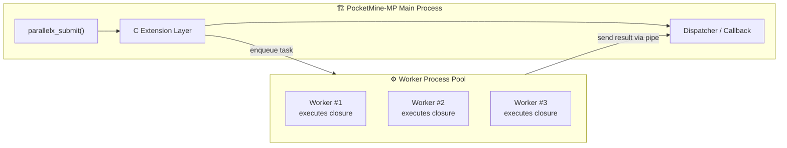

# ext_parallelx

## 🧠 What is parallelx?

`parallelx`はPocketMine-MP用の **マルチプロセス並列実行拡張**

`AsyncTask`のように、単一プロセス内でタスクを処理するのではなく、  
**外部プロセスプールでPHPクロージャを安全に並列実行** し、  
結果をメインスレッド(PMMPのプロセス)へ返すことが可能 

## 🏗 Architecture



## 🧩 Example (PocketMine-MP)


```php
<?php
declare(strict_types=1);

use pocketmine\plugin\PluginBase;
use pocketmine\scheduler\ClosureTask;
use ParallelX\Helper;

final class MyPlugin extends PluginBase{
    protected function onEnable() : void{
        // 必要なら: php実行ファイル / workerスクリプト / autoload を指定
        $phpCli = "/path/to/php"; // 例: /home/pmmp/pmmp/bin/php8/bin/php
        $workerScript = $this->getDataFolder() . "parallelx_worker.php";
        $autoload = "/path/to/server/vendor/autoload.php";
        parallelx_init(4, $phpCli, $workerScript, $autoload);

        // PMMPのメインスレッド側で 1tick ごとに poll
        $this->getScheduler()->scheduleRepeatingTask(new ClosureTask(function() : void{
            parallelx_poll();
        }), 1);

        // (1) 実行したいクロージャを用意（use で値を閉じ込められる）
        $mul = 7;
        $task = function(int $n) use ($mul) : array{
            $sum = 0;
            for($i = 0; $i < $n; $i++){
                $sum += (($i * $mul) % 97);
            }
            return ["sum" => $sum, "pid" => getmypid()];
        };

        // (2) クロージャを「ソース文字列 + use変数」に分解して token 登録
        $desc = Helper\extract_closure_descriptor($task);
        $token = parallelx_register($desc["source"], $desc["bound_b64"]);

        // (3) token + 引数 を投げると worker が実行し、poll() 経由で callback が呼ばれる
        parallelx_submit_token($token, [2_000_000], function(array $res) : void{
            if(!$res["success"]){
                $this->getLogger()->warning("parallelx failed: " . $res["data"]);
                return;
            }

            // data は base64(serialize(['return'=>..., 'output'=>...])) で返ってくる
            $payload = unserialize(base64_decode($res["data"]), ["allowed_classes" => false]);
            $this->getLogger()->info("Result: " . json_encode($payload["return"]));
        });
    }

    protected function onDisable() : void{
        parallelx_shutdown();
    }
}
```

## 🛠 Installation

ビルド

```bash
phpize
./configure --with-php-config=php-config CC=gcc
make clean
make CC=gcc -j$(nproc)
make install
```

php.iniに追記

```ini
extension=parallelx
```
