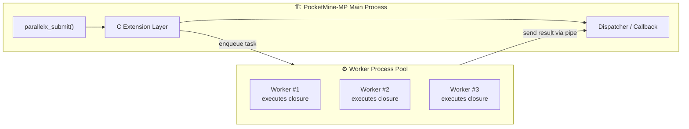

# ext_parallelx

## 🧠 What is ext_parallelx?

`ext_parallelx`はPocketMine-MPのために設計された  
**マルチプロセス並列実行拡張**

従来の`AsyncTask`のように、単一プロセス内でタスクを処理するのではなく、  
**外部プロセスプールでPHPクロージャを安全に並列実行** し、  
結果をメインスレッドへコールバックで返すことが可能

tick遅延を最小化し、高負荷処理（ファイルIO・HTTP通信・DBアクセスなど）を  
**メインスレッドから完全に分離**することを目的とする

## 🏗 Architecture



## 🧩 Example

```php
public function onEnable(): void {
    // optional: PHPのパス、workerscriptのパス、オートローダのパス
    $phpCli = '/home/pmmp/pmmp/bin/php7/php';
    $workerScript = $this->getDataFolder() . 'parallelx_worker.php';
    $autoload = '/path/to/server/vendor/autoload.php';
    parallelx_init(4, $phpCli, $workerScript, $autoload);

    // 1tick周期でpoll
    $this->getScheduler()->scheduleRepeatingTask(new \pocketmine\scheduler\CallbackTask(function(): void {
        parallelx_poll();
    }), 1);
}

use ParallelX\Helper;

$closure = function($n) {
    $s = 0;
    for ($i = 0; $i < $n; ++$i) $s += ($i % 2 ? -1 : 1);
    return $s;
};

$desc = Helper\extract_closure_descriptor($closure);
$token = parallelx_register($desc['source'], $desc['bound_b64']);

parallelx_submit_token($token, [2000000], function($res) {
    if ($res['success']) {
        $payload = unserialize(base64_decode($res['data']));
        $this->getLogger()->info("Result: " . var_export($payload['return'], true));
    } else {
        $this->getLogger()->warning("failed: " . $res['data']);
    }
});

```

## 🛠 Installation

ビルド

```bash
phpize
./configure --with-php-config=php-config CC=gcc
make clean
make CC=gcc -j$(nproc)
make install
```

php.iniに追記

```ini
extension=parallelx
```
